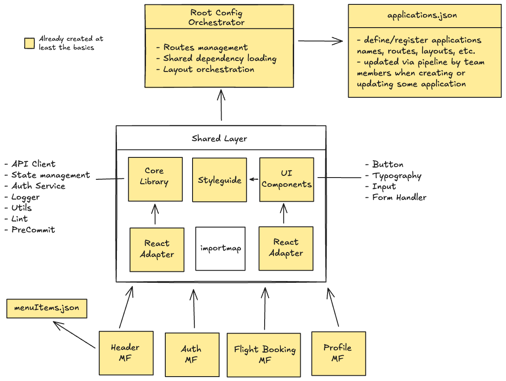

# Welcome to Skymfe's Organization

This organization is a collection of microfrontends that are used to build the Skymfe website with Single-SPA.
I built this organization to share my knowledge and to learn from the community about the best practices and tools for building microfrontends.

## Project Architecture

The Skymfe project follows a microfrontend architecture with the following key components:

### Root Config Orchestrator

- Manages application routes
- Handles shared dependency loading
- Orchestrates layout composition
- Interfaces with `applications.json` which is a separated repository that defines/registers applications names, routes, layouts, and is updated via pipeline when team members create or update applications

### Shared Layer

The shared layer serves as a common foundation for all microfrontends, containing:

#### Core Library

Core Library is a library that contains the core functionality that is shared between all microfrontends. It can be extended with React, Vue, Angular, etc.

- API Client for backend communication
- State management solution
- Authentication service
- Logging functionality
- Utility functions
- Linting configuration
- PreCommit hooks

#### Core Library React Adapter

React Adapter is a library that extends the Core Library with React-specific functionality.

- React hooks
- React utilities

#### Import Map

Import Map is a configuration that defines shared dependencies between the microfrontends.

#### UI Components

UI Components are a library that contains the UI components made without any framework that are shared between all microfrontends and can be extended with React, Vue, Angular, etc.

- Button components
- Typography system
- Input elements
- Form handling utilities

#### UI Components React Adapter

React Adapter is a library that extends the UI Components with React-specific functionality.

### Microfrontend Applications

The system consists of several specialized microfrontends:

- Header MF: Navigation and header components (uses menuItems.json for configuration which is a separated repository)
- Auth MF: Authentication and authorization features like login, logout, register, etc.
- Flight Booking MF: Flight reservation functionality. In this example we will implement the entire flight booking process in this microfrontend, but as the project grows, we can move the checkout part to a separate microfrontend, because we can have other functionalities adding to the checkout process like insurance, etc.
- Profile MF: User profile management.

Each microfrontend is independently deployable while sharing common functionality through the shared layer, enabling a modular yet cohesive application architecture.

## Repositories

So in summary, we have the following repositories:

- [root-config](https://github.com/skymfe/root-config)
- [applications](https://github.com/skymfe/applications)
- [core-library](https://github.com/skymfe/core-library)
- [core-library-react-adapter](https://github.com/skymfe/core-library-react-adapter)
- [ui-components](https://github.com/skymfe/ui-components)
- [ui-components-react-adapter](https://github.com/skymfe/ui-components-react-adapter)
- [importmap](https://github.com/skymfe/importmap)
- [menu-items](https://github.com/skymfe/menu-items)
- [header-mf](https://github.com/skymfe/header-mf)
- [auth-mf](https://github.com/skymfe/auth-mf)
- [flight-booking-mf](https://github.com/skymfe/flight-booking-mf)
- [profile-mf](https://github.com/skymfe/profile-mf)

## How to add a new microfrontend

1. Create a new repository and add the necessary files.
2. Add the repository to the `applications` repository.
3. (Optional) Add the repository to the `menu-items` repository.

But in the future, we will use the pipeline to create the new microfrontend and add it to the `applications` repository automatically, so this way we avoid human error.

## Contribution Guidelines

1. Create a new branch from the `main` branch.
2. Make your changes and commit them.
3. Push your changes to your branch.
4. Create a pull request.

We use the [Conventional Commits](https://www.conventionalcommits.org/) specification for our commit messages.
